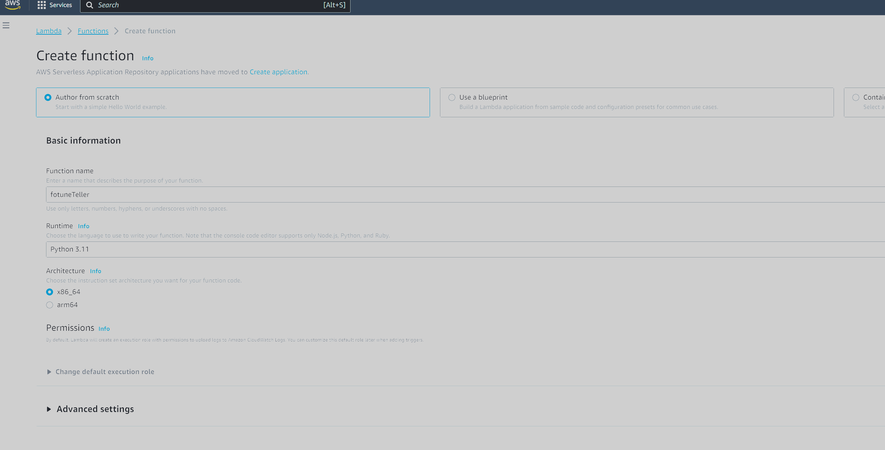
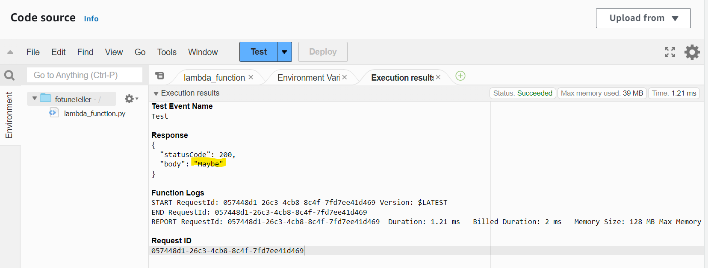
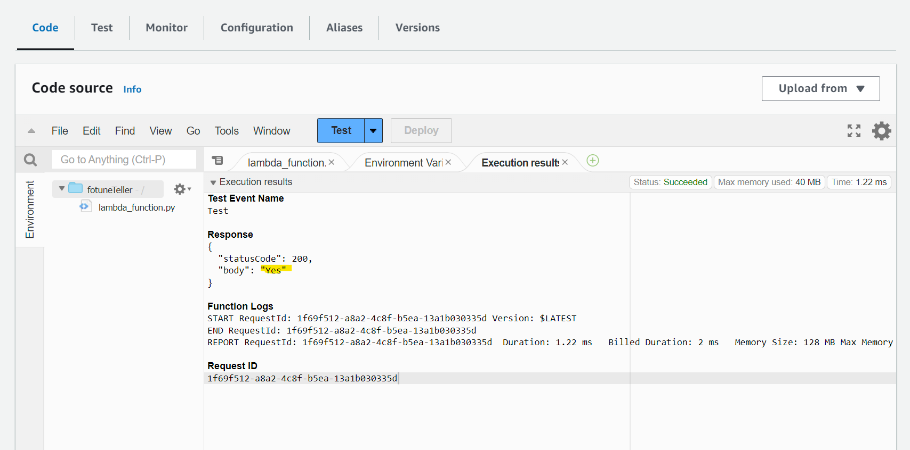
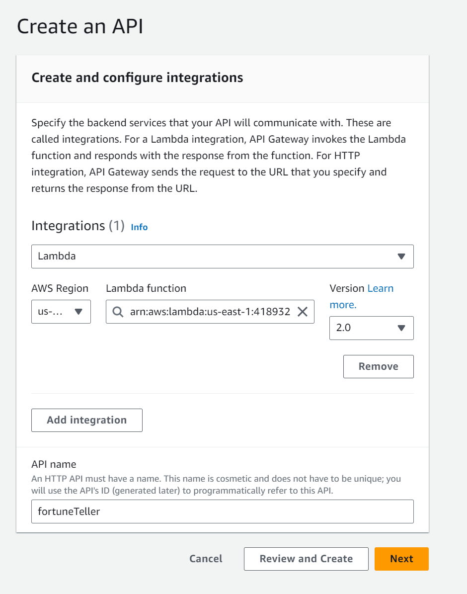
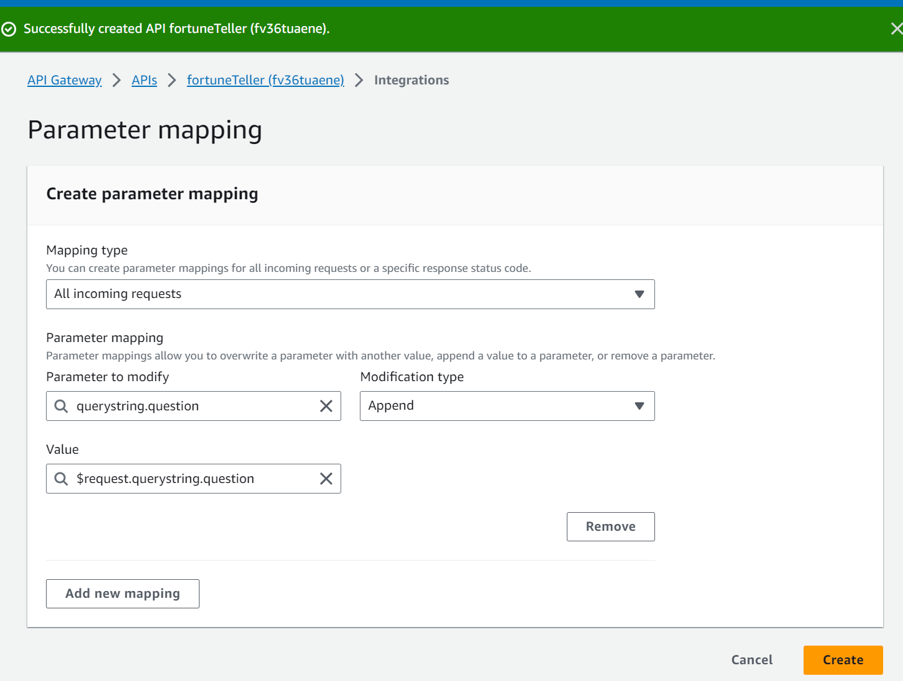
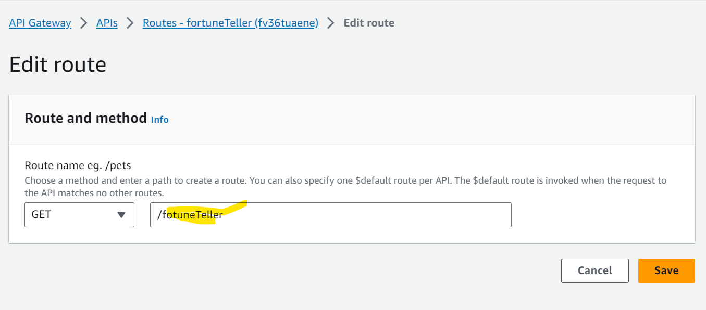

# fortunetellerAWS
- Built a Fortune Teller application using AWS Lambda and API Gateway, that responds to user questions.

## Services/Tools Used
- AWS Lambda
- AWS API Gateway

## Set Up An AWS Lambda Function
- Created Lambda Function and tested the default code
- 

- Replaced the code with the fortune teller code: 
```js
import json
import random

def generate_fortune():
    # Generate a random integer between 1 and 3
    random_number = random.randint(1, 3)

    # Map the random integer to a response using conditional statements
    if random_number == 1:
        response = "Yes"
    elif random_number == 2:
        response = "No"
    else:
        response = "Maybe"

    return response

def lambda_handler(event, context):
    # Call the generate_fortune function and return the response
    fortune = generate_fortune()
    
    # Construct the response object
    response = {
        "statusCode": 200,
        "body": fortune
    }
    
    return response
```
- Deployed the code to save and sync changes.

- When pressing the test button I receive random responses:
- 
- 


## Create an API Gateway
- Chose HTTP API - Added Lambda Integration, Region, and Lambda Function. Named API fortuneTeller:
- 

- Under Configure Routes, Changed method to GET which means to retrieve the data from the API without making changes.

- Created Parameter mapping which modifies the incoming request by extracting specific values and appending it to the query string of the request:
- 

- When entering the API URL I receive message not found error. This means we will have to specify in the URL the fortuneteller Here is an example I put "dev/fortuneTeller?question="Should I eat right now?":

- Came across an error after implementing the url. Ensure that the API route name is accurate iun the GET method. Instead of fortuneTeller I had entered fotuneTeller:
- 

- Corrected the name for the Lambda Function and recreated new integration under new Lamdba Function. This led to the fortune teller application to work


## Result
- Asked the fortune teller If I should eat right now and the Fortune Teller said "Yes". **Grabs snack**
- 
